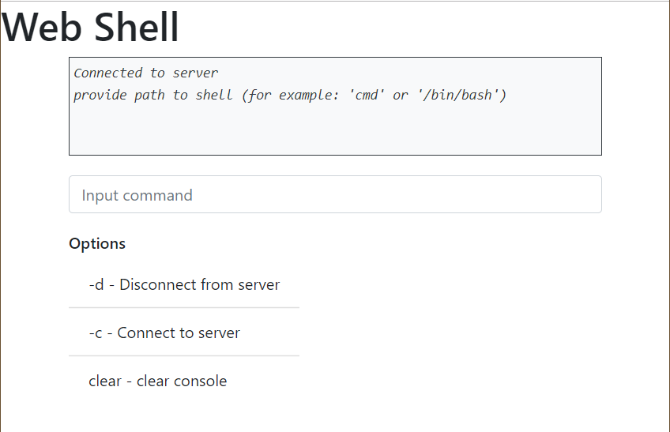
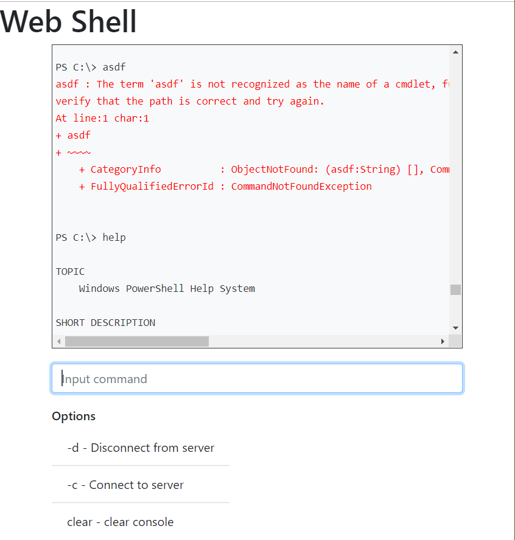

# Python Web Shell
The purpose of this project was to create a web application in Python 
which would allow the user to execute arbitrary shell commands on the 
remote web server via a browser.

The application provides the user with a text box where they will enter 
the commands. The commands are sent to the server. The server executes 
the commands in a shell sub-process, captures standard and error output 
and sends it back to the browser, which displays it (using different 
colours for standard and error output, respectively).

> Do not deploy this application on remote server or at least use secure connection.

## Install

Create a virtual environment (Python 3 built-in venv) and (optionally) 
activate it:

    python3 -m venv venv
    . venv/bin/activate

Or on Windows cmd:

    python -m venv venv
    venv\Scripts\activate.bat

Install WebShell:

    pip install . -r requirements.txt
> requirements-stable.txt contains package versions exactly used for development and test, however these packages may be obsolete or contain vulnerabilities.  requirements.txt allows installation of the newest versions within a major release.

## Run

    export FLASK_APP=webshell
    flask run
Or on Windows cmd:

    set FLASK_APP=webshell
    flask run
Open http://localhost:5000 in a browser.

## Debugging

    FLASK_APP=webshell
    FLASK_DEBUG=true
    flask run --no-reload
    
or execute main script in a debugger of your choice.

Debugging in PyCharm:
1. Add new Python configuration,
2. Choose target to run: Module and type `flask`
3. In parameters type `run --no-reload`
4. Add environment variables
    - Name: `FLASK_APP`, value `webshell`
    - Name: `FLASK_DEBUG`, value `true`

## Screenshots

## Resources
- [Flask](http://flask.pocoo.org)
- [Flask-SocketIO](http://flask-socketio.readthedocs.io/en/latest/)
- [Socket.IO](https://socket.io/)
- [sarge](https://sarge.readthedocs.io/en/latest/)
